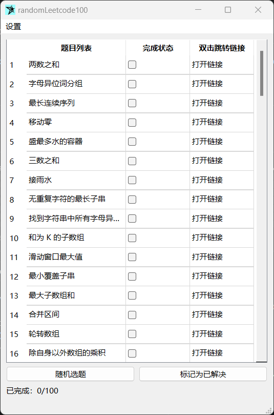

# randomLeetcode100_QTversion

本项目是之前控制台应用程序版本的使用Qt框架的图形界面版本。




本项目仅供娱乐或参考。

欢迎在issue留言！😀

[控制台应用程序版本](https://github.com/Aur1anna/randomLeetcode100)：

https://github.com/Aur1anna/randomLeetcode100


## 快速开始

请下载并使用release版本。

解压后，打开`randomLeetcode100.exe`即可使用。

提供了动态链接形式的可执行文件以供使用。

release版本地址：https://github.com/Aur1anna/randomLeetcode100_QTversion/releases


## 本地构建

如果你的本地有qt环境，可以手动构建并生成动态链接。

首先clone仓库。然后在qt中打开项目，release构建。

动态链接部署：

在/build/../release文件夹下，使用以下命令来收集所有必要的依赖项：

```shell
& "path\to\your\windeployqt.exe" ".\randomLeetcode100_3.exe"
```

例如：

```shell
& "F:\StudyAndWork\qt\qt\6.5.3\mingw_64\bin\windeployqt.exe" ".\randomLeetcode100_3.exe"
```

